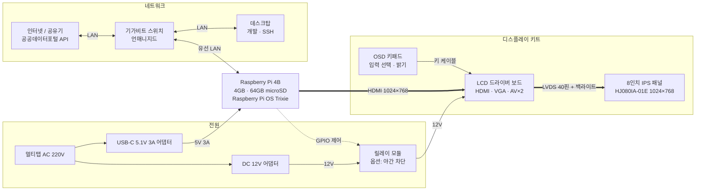
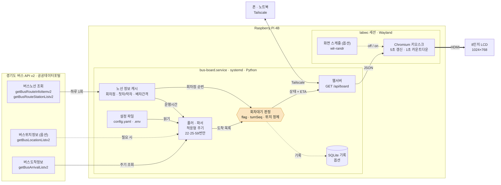
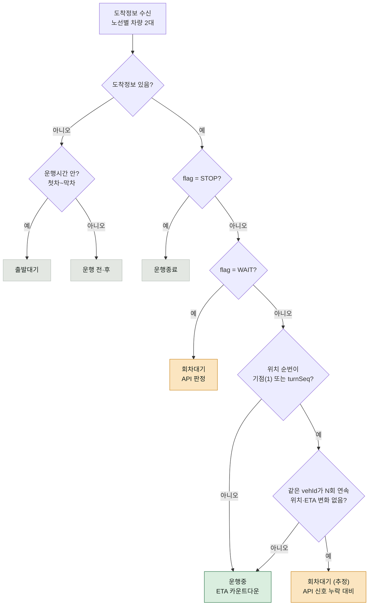

# 버스 도착 전광판 (bus-board)

용인 정류장 2곳의 **22·25·59번** 버스 도착정보를 노선당 **다음 2대**까지 8인치 화면에 띄우고, **회차대기** 차량을 실제 도착시간과 구분해 표시하는 개인 토이프로젝트.

- 배경: 카카오맵은 노선마다 정류장이 달라 두 번 눌러야 하고, "회차대기"를 실제 도착시간으로 착각하기 쉬움
- 형태: 알람시계처럼 두는 상시 표시 화면
- 상태 (2026-09-16): 하드웨어 연결 완료 → 1차 완료. API 3종 승인·실호출 검증·정류장/노선 ID 확보 ([phase1-probe.md](phase1-probe.md))

---

## 1. HW 구성

| 부품 | 스펙 / 역할 | 체크 포인트 |
|---|---|---|
| Raspberry Pi 4B | 4GB RAM, 64GB microSD, 홈서버 겸용. 조회·판정·웹서버·키오스크 전부 담당 | USB-C 5.1V 3A 전원 (부족하면 저전압 경고) |
| micro-HDMI ↔ HDMI | Pi HDMI0(USB-C 쪽 포트) → 드라이버 보드 | |
| LCD 드라이버 보드 | 입력 HDMI·VGA·AV×2, HDMI→LVDS 변환, 백라이트 구동 (RTD2660 계열 추정) | 입력 자동전환이 안 될 수 있음 → OSD로 HDMI 고정 |
| 8" IPS 패널 | HJ080IA-01E (Innolux), 1024×768 4:3, LVDS 40핀 FPC, WLED 백라이트 | UI는 1024×768 가로 기준 |
| OSD 키패드 | 입력 선택, 밝기 | 밤에 밝으면 밝기 낮추기 |
| 기가비트 스위치 | 방까지 온 랜선 분배, Pi·데스크탑 유선 연결 | |
| 릴레이 모듈 (옵션) | Pi GPIO로 야간 12V 차단 | HDMI를 꺼도 보드가 백라이트를 켜둘 때만 |



> 릴레이가 없으면 DC 12V 어댑터 → 드라이버 보드 직결.

---

## 2. SW 구성

| 구성 요소 | 내용 |
|---|---|
| OS / 세션 | Raspberry Pi OS (Debian 13 Trixie 기반), labwc (Wayland) |
| 백엔드 | `bus-board.service` (systemd) · Python FastAPI (제안) |
| 폴러·파서 | 경기도 버스 API v2 주기 조회, 22·25·59번만 추림, 적응형 주기 |
| 노선 정보 캐시 | 회차점·첫차/막차·배차간격, 하루 1회 갱신 |
| 회차대기 판정 | `flag`, `turnSeq`, 위치 정체 감지 (3장) |
| 웹서버 | `GET /api/board` → 최신 상태 JSON, 대시보드 정적 파일 제공 |
| 설정 | `config.yaml` (정류장·노선), `.env` (서비스키) |
| 화면 | labwc autostart로 Chromium `--kiosk` 실행, 5초마다 JSON 갱신 + 1초 카운트다운 |
| 원격 | Tailscale: 밖에서 대시보드 확인, SSH 유지보수 |
| 옵션 | SQLite 판정 로그 (임계값 튜닝), `wlr-randr`로 야간 HDMI off |



### API 선택 이유

- **경기도 API v2**: `flag`에 `WAIT`(회차지대기)가 있고 `turnSeq`(회차점 순번)도 줌 → 판정 로직에 바로 사용. 개발계정 **1,000건/일**
- **TAGO 도착정보**: 개발계정 10,000건/일이지만 회차대기·운행상태 필드 없음 → 도착시간 백업용
- **서울시 API**: 정류장이 용인이라 해당 없음

### API 호출 예산

```
개발계정 한도                          1,000건/일
정류장 2곳 × 1분 × 18.3시간   =   2,200건/일   ← 초과
정류장 2곳 × 2.5분 × 18.3시간 =     880건/일   ← 채택 (far=150s)
```

- 활용사례 등록 후 **운영계정 트래픽 증가 신청** (자동승인)
- 그 전까지: 첫차 전·막차 후 조회 중지, 도착 임박할 때만 주기 단축
- 화면은 `predictTimeSec`를 1초씩 깎아 표시 → 조회 간격이 길어도 끊겨 보이지 않게

---

## 3. 회차대기 판정



```
위치 순번  = staOrder − locationNo1
정차 조건  = 위치 순번 ∈ {1(기점), turnSeq(회차점)}     // stateCd1 == 1 이면 더 확실
정체 조건  = 같은 vehId1가 N회 연속 위치 그대로 && predictTimeSec1 안 줄어듦
```

- 위치정보 API 없이 도착정보만으로 차량 위치 계산 가능
- N은 SQLite 로그 쌓아서 튜닝

### 사용하는 API 필드

**getBusArrivalListv2** — `http://apis.data.go.kr/6410000/busarrivalservice/v2/getBusArrivalListv2`
파라미터: `serviceKey`, `stationId`, `format=json`

| 필드 | 뜻 (매뉴얼) | 쓰는 곳 |
|---|---|---|
| `flag` | RUN·PASS 운행중 / STOP 운행종료 / WAIT 회차지대기 | 1차 판정 |
| `staOrder` | 요청한 정류소가 노선의 몇 번째인지 | 차량 위치 계산 |
| `turnSeq` | 노선의 회차점 순번 | 회차점 비교 |
| `locationNo1·2` | 차량이 몇 번째 전 정류소에 있는지 | 차량 위치 계산 |
| `stateCd1·2` | 0 교차로통과 · 1 정류소도착 · 2 정류소출발 | 정차 여부 보조 |
| `predictTime1·2` / `predictTimeSec1·2` | 도착예상시간 (분 / 초) | 표시 · 카운트다운 · 정체 감지 |
| `vehId1·2`, `plateNo1·2` | 차량 아이디 / 번호 | 조회 간 같은 차 추적 |
| `stationNm1·2` | 차량 현재 위치 정류소명 | 디버깅 |
| `routeId`, `routeName`, `routeDestName` | 노선 ID / 번호 / 진행방향 종점 | 노선 필터 · 표시 |

에러코드: `0` 정상, `1` 시스템 에러, `2` 필수 파라미터 없음, `4` 결과 없음

**getBusRouteInfoItemv2** — `.../6410000/busrouteservice/v2/getBusRouteInfoItemv2` (`routeId`)
- `upFirstTime`·`upLastTime` 평일 기점 첫차·막차 (주말은 `sat*`/`sun*`), `peekAlloc`·`nPeekAlloc` 배차간격(분), `turnStID`·`turnStNm` 회차정류소

**getBusRouteStationListv2** — `.../6410000/busrouteservice/v2/getBusRouteStationListv2` (`routeId`)
- `stationSeq` 정류소 순번, `turnYn` 회차점 여부, `stationId`, `stationName`

**getBusLocationListv2 (옵션)** — `.../6410000/buslocationservice/v2/getBusLocationListv2` (`routeId`)
- `vehId`, `stationSeq`, `stateCd`, `plateNo`

---

## 4. 설정 · 운영 메모

- 해상도가 안 잡히면 `/boot/firmware/cmdline.txt` 끝에 `video=HDMI-A-1:1024x768@60`
- 키오스크 자동실행: `~/.config/labwc/autostart`에 Chromium `--kiosk http://localhost:<port>` 등록
- 화면 꺼짐 방지: raspi-config의 Screen Blanking 끄기
- 서비스키는 `.env`에만, git에 올리지 않기

## 5. 남은 확인 항목

- [ ] HDMI 출력 off 시 드라이버 보드가 백라이트까지 끄는지 → 안 끄면 릴레이 옵션
- [x] 공공데이터포털 활용신청 — 도착정보·버스노선·정류소 3종 승인 (2026-09-16, 2028-09-16 만료)
- [x] 정류장 두 곳 응답 수집 완료 → [phase1-probe.md 4장](phase1-probe.md#4-확보한-값)
      도담마을아이파크.죽전휴먼빌 `228001059` (22·59) · 대일초교후문 `228003549` (25)
- [ ] 운영계정 트래픽 증가 신청
- [ ] 회차대기 추정 임계값 N 정하기 (로그 기반) — `config.yaml` 의 `judge.stall_count`, 현재 3
- [ ] `flag=WAIT` 실물 응답 수집 (25번이 회차점에서 4정거장이라 관찰 확률이 가장 높다)

## 참고

- 경기버스정보 공유서비스 매뉴얼: https://www.gbis.go.kr/gbis2014/publicService.action?cmd=mBusArrivalStation
- 공공데이터포털 경기도_버스도착정보 조회: https://www.data.go.kr/data/15080346/openapi.do
- TAGO 버스도착정보: https://www.data.go.kr/data/15098530/openapi.do
- HJ080IA-01E 패널 스펙: https://www.panoxdisplay.com/tft-lcd/8-inch-tft-lcd-1024x768-lvds-interface.html
- Raspberry Pi 설정 문서: https://www.raspberrypi.com/documentation/computers/configuration.html