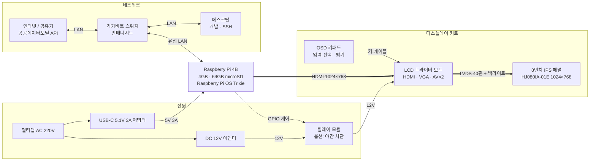
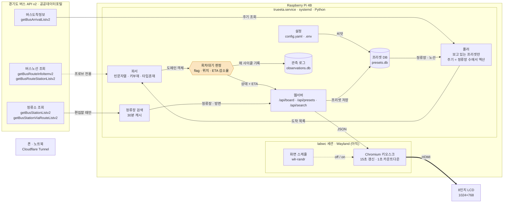

# 버스 도착 전광판 (bus-board)

용인 정류장 2곳의 **22·25·59번** 버스 도착정보를 노선당 **다음 2대**까지 8인치 화면에 띄우고, **회차대기** 차량을 실제 도착시간과 구분해 표시하는 개인 토이프로젝트.

- 배경: 카카오맵은 노선마다 정류장이 달라 두 번 눌러야 하고, "회차대기"를 실제 도착시간으로 착각하기 쉬움
- 형태: 알람시계처럼 두는 상시 표시 화면
- 상태 (2026-09-23): 폴링·회차대기 판정·전광판 화면·프리셋 편집까지 동작. 관측 로그 수집 중
  - 1차 프로브 [phase1-probe.md](phase1-probe.md) · 판정 [judge-algorithm.md](judge-algorithm.md)
  - 프리셋 [preset-design.md](preset-design.md) · 운영계정 [data-portal-submission.md](data-portal-submission.md)

---

## 1. HW 구성

| 부품 | 스펙 / 역할 | 체크 포인트 |
|---|---|---|
| Raspberry Pi 4B | 4GB RAM, 64GB microSD, 홈서버 겸용. 조회·판정·웹서버·키오스크 전부 담당 | USB-C 5.1V 3A 전원 (부족하면 저전압 경고) |
| micro-HDMI ↔ HDMI | Pi HDMI0(USB-C 쪽 포트) → 드라이버 보드 | |
| LCD 드라이버 보드 | 입력 HDMI·VGA·AV×2, HDMI→LVDS 변환, 백라이트 구동 (RTD2660 계열 추정) | 입력 자동전환이 안 될 수 있음 → OSD로 HDMI 고정 |
| 8" IPS 패널 | HJ080IA-01E (Innolux), 1024×768 4:3, LVDS 40핀 FPC, WLED 백라이트 | UI는 1024×768 가로 기준 |
| OSD 키패드 | 입력 선택, 밝기 | 밤에 밝으면 밝기 낮추기 |
| 기가비트 스위치 | 방까지 온 랜선 분배, Pi·데스크탑 유선 연결 | |
| 릴레이 모듈 (옵션) | Pi GPIO로 야간 12V 차단 | HDMI를 꺼도 보드가 백라이트를 켜둘 때만 |


```mermaid
flowchart LR
    subgraph NET["네트워크"]
        INET["인터넷 / 공유기<br/>공공데이터포털 API"]
        SW["기가비트 스위치<br/>언매니지드"]
        PC["데스크탑<br/>개발 · SSH"]
    end

    PI["Raspberry Pi 4B<br/>4GB · 64GB microSD<br/>Raspberry Pi OS Trixie"]

    subgraph KIT["디스플레이 키트"]
        DRV["LCD 드라이버 보드<br/>HDMI · VGA · AV×2"]
        LCD["8인치 IPS 패널<br/>HJ080IA-01E 1024×768"]
        KEY["OSD 키패드<br/>입력 선택 · 밝기"]
    end

    subgraph PWR["전원"]
        TAP["멀티탭 AC 220V"]
        USBC["USB-C 5.1V 3A 어댑터"]
        DC12["DC 12V 어댑터"]
        RLY["릴레이 모듈<br/>옵션: 야간 차단"]
    end

    INET <-->|LAN| SW
    SW <-->|LAN| PC
    SW <-->|유선 LAN| PI

    PI ==>|"HDMI 1024×768"| DRV
    DRV ==>|"LVDS 40핀 + 백라이트"| LCD
    KEY -->|키 케이블| DRV

    TAP --> USBC
    TAP --> DC12
    USBC -->|5V 3A| PI
    DC12 -->|12V| RLY
    RLY -->|12V| DRV
    PI -.->|GPIO 제어| RLY
```

> 릴레이가 없으면 DC 12V 어댑터 → 드라이버 보드 직결.

---

## 2. SW 구성

| 구성 요소 | 내용 | 구현 |
|---|---|---|
| OS / 세션 | Raspberry Pi OS (Debian 13 Trixie), labwc (Wayland) | |
| 백엔드 | `trueeta.service` (systemd) · Python FastAPI, 포트 8099 | [api.py](../src/trueeta/api.py) |
| 폴러 | 시간대별 주기(08~18시 120초 / 그 외 600초), 운행시간 밖 중지 | [poller.py](../src/trueeta/poller.py) |
| 파서 | 실응답의 빈 문자열·키 부재·타입 혼재 흡수 | [gbis/parser.py](../src/trueeta/gbis/parser.py) |
| 회차대기 판정 | `flag=WAIT` · 위치(기점/회차점) · ETA 감소율 — 순수 함수 | [judge.py](../src/trueeta/judge.py) |
| 관측 로그 | 매 사이클 기록, 임계값 튜닝 근거 (`var/observations.db`) | [storage.py](../src/trueeta/storage.py) |
| 프리셋 | 정류장·노선 묶음. 보고 있는 것만 폴링 (`var/presets.db`) | [presets.py](../src/trueeta/presets.py) |
| 정류장 검색 | 이름·좌표 검색과 경유 노선. 30분 캐시 | [search.py](../src/trueeta/search.py) |
| 웹서버 | `/api/board?preset=` · `/api/presets` · `/api/search/*` · 화면 제공 | [api.py](../src/trueeta/api.py) |
| 설정 | `config.yaml`(프리셋 씨앗·주기·예산), `.env`(서비스키) | [config.py](../src/trueeta/config.py) |
| 화면 | 전광판 `/`, 프리셋 편집 `/edit`. 빌드 없는 HTML | [web/](../src/trueeta/web/) |
| 원격 | Cloudflare Tunnel ([remote-access.md](remote-access.md)) | |
| 키오스크 | labwc autostart → Chromium `--kiosk`, 꺼지면 재시작 | [scripts/kiosk.sh](../scripts/kiosk.sh) · [kiosk.md](kiosk.md) |
| 아직 | 적응형 주기, 야간 화면 off, 화면에 B안 반영 | |

> **노선 정보 캐시는 구현하지 않았다.** 첫차·막차를 하루 1회 받아 캐시하기로
> 했으나 `config.yaml` 의 `service_window` 에 손으로 적어둔 상태다.
> 그래서 `버스노선 조회` API 는 런타임에서 호출하지 않는다.


```mermaid
flowchart LR
    subgraph API["경기도 버스 API v2 · 공공데이터포털"]
        A_ROUTE["버스노선 조회<br/>getBusRouteInfoItemv2<br/>getBusRouteStationListv2"]
        A_ARR["버스도착정보<br/>getBusArrivalListv2"]
        A_STA["정류소 조회<br/>getBusStationListv2<br/>getBusStationViaRouteListv2"]
    end

    subgraph RPI["Raspberry Pi 4B"]
        subgraph SVC["trueeta.service · systemd · Python"]
            CFG["설정<br/>config.yaml · .env"]
            PRESET[("프리셋 DB<br/>presets.db")]
            POLL["폴러<br/>보고 있는 프리셋만<br/>주기 = 정류장 수에서 역산"]
            PARSE["파서<br/>빈문자열 · 키부재 · 타입혼재"]
            JUDGE{{"회차대기 판정<br/>flag · 위치 · ETA 감소율"}}
            SEARCH["정류장 검색<br/>30분 캐시"]
            WEB["웹서버<br/>/api/board · /api/presets · /api/search"]
            OBS[("관측 로그<br/>observations.db")]
        end
        subgraph SES["labwc 세션 · Wayland (아직)"]
            SCHED["화면 스케줄<br/>wlr-randr"]
            KIOSK["Chromium 키오스크<br/>15초 갱신 · 1초 카운트다운"]
        end
    end

    PHONE["폰 · 노트북<br/>Cloudflare Tunnel"]
    LCD["8인치 LCD<br/>1024×768"]

    A_ROUTE -.->|프로브 전용| PARSE
    A_ARR -->|주기 조회| POLL
    A_STA -->|편집할 때만| SEARCH
    CFG -->|씨앗| PRESET
    PRESET -->|정류장 · 노선| POLL
    POLL -->|도착 목록| PARSE
    PARSE -->|도메인 객체| JUDGE
    JUDGE -->|상태 + ETA| WEB
    JUDGE -->|매 사이클 기록| OBS
    SEARCH -->|정류장 · 방면| WEB
    WEB -->|프리셋 저장| PRESET
    WEB -->|JSON| KIOSK
    SCHED -.->|off / on| KIOSK
    KIOSK ==>|HDMI| LCD

    classDef core fill:#FBE5C0,stroke:#C98217,color:#17201B
    class JUDGE core
```

### API 선택 이유

- **경기도 API v2**: `flag`에 `WAIT`(회차지대기)가 있고 `turnSeq`(회차점 순번)도 줌 → 판정 로직에 바로 사용. 개발계정 **1,000건/일**
- **TAGO 도착정보**: 개발계정 10,000건/일이지만 회차대기·운행상태 필드 없음 → 도착시간 백업용
- **서울시 API**: 정류장이 용인이라 해당 없음

### API 호출 예산

**한도는 오퍼레이션(상세기능)마다 따로 1,000건/일이다.** 활용신청 화면의
'상세기능' 표에 기능별로 각각 적혀 있다. 도착정보 조회를 900건 써도
정류장 검색은 자기 몫 1,000건을 그대로 갖는다.

폴링이 쓰는 것은 `getBusArrivalListv2` 하나뿐. 1사이클에 정류장 1곳당 1콜이다.

| 주기 (정류장 2곳) | 하루 호출 | |
|---|---|---|
| 전 시간대 1분 | 2,200건 | 한도의 2.2배 — **개발계정으로는 불가능** |
| 전 시간대 2.5분 | 880건 | 여유 120건 |
| **08~18시 2분 + 그 외 10분** | **700건** | **채택** (여유 300) |

1분 주기를 쓰려면 1분 구간을 하루 7시간 이내로 좁혀야 976건으로 겨우
들어온다(여유 24건). 실용적이지 않아 **전 시간대 1분은 운영계정이 전제**다.

주기는 상수가 아니라 활성 정류장 수에서 역산한다 (`config.intervals_for`).
프리셋에 정류장을 더 담으면 주기가 자동으로 길어져 예산 안에 남는다.
예산 자체는 `polling.daily_budget` 으로 바꾼다.

- 운영계정 신청 자료: [data-portal-submission.md](data-portal-submission.md)
- 운행시간(05:50~00:10) 밖에는 호출하지 않고 노선 목록만 '운행종료'로 띄운다
- 화면은 조회 시각 기준으로 `predictTimeSec` 를 1초씩 깎는다. 다만 실제
  감소율은 0.6~0.8 이라 주기가 길수록 낙관적으로 어긋난다 ([todo.md](todo.md) 2번)

---

## 3. 회차대기 판정

> 구현된 알고리즘 전체는 **[judge-algorithm.md](judge-algorithm.md)** 에 있다.
> 여기는 요약만 둔다 — 흐름도를 두 곳에 두면 갈라진다.

회차지에서 출발을 기다리는 버스가 "4분"으로 뜨고 실제로는 15분이 걸린다.
`predictTime` 이 "달리면 4분"일 뿐 회차지 체류를 포함하지 않기 때문이다.

**시간표와 대조하는 방법은 쓸 수 없다.** 마을버스는 정시 운행이 아니라
배차간격 운행이라 "몇 시 몇 분 도착" 데이터가 GBIS·TAGO 어디에도 없다
(고속·시외버스만 시간표 API 가 있다). 대신 신호 세 가지를 쓴다.

| 신호 | 언제 알 수 있나 | 세기 |
|---|---|---|
| `flag = WAIT` | 조회 1회 | 확정. 마을버스에선 거의 안 온다 |
| **위치** | **조회 1회** | 추정. 나가기 직전에 보는 화면이라 이 즉시성이 핵심 |
| ETA 감소율 | 조회 2회 이상 | 추정. 시간표를 대신하는 기준선 |

```
위치 순번  = staOrder − locationNo
정차 조건  = 위치 순번 ∈ {1(기점), turnSeq(회차점)}    // stateCd == 1 이면 더 확실
감소율     = (이전 ETA − 현재 ETA) / 경과 시간
             정상 주행 0.6~1.0  ·  회차대기 0 근처
```

- 위치정보 API 없이 도착정보만으로 차량 위치 계산 가능
- `flag` 는 노선 단위 상태다. **차량 유무를 먼저 봐야 한다** (실응답에서 확인)
- 위치만으로 확정하지 않고, 화면에 "회차지" 경고로 먼저 알린다
- 임계값은 `var/observations.db` 를 `scripts/analyze.py` 로 분석해 정한다

### 사용하는 API 필드

**getBusArrivalListv2** — `http://apis.data.go.kr/6410000/busarrivalservice/v2/getBusArrivalListv2`
파라미터: `serviceKey`, `stationId`, `format=json`

| 필드 | 뜻 (매뉴얼) | 쓰는 곳 |
|---|---|---|
| `flag` | RUN·PASS 운행중 / STOP 운행종료 / WAIT 회차지대기 | 1차 판정 |
| `staOrder` | 요청한 정류소가 노선의 몇 번째인지 | 차량 위치 계산 |
| `turnSeq` | 노선의 회차점 순번 | 회차점 비교 |
| `locationNo1·2` | 차량이 몇 번째 전 정류소에 있는지 | 차량 위치 계산 |
| `stateCd1·2` | 0 교차로통과 · 1 정류소도착 · 2 정류소출발 | 정차 여부 보조 |
| `predictTime1·2` / `predictTimeSec1·2` | 도착예상시간 (분 / 초) | 표시 · 카운트다운 · 정체 감지 |
| `vehId1·2`, `plateNo1·2` | 차량 아이디 / 번호 | 조회 간 같은 차 추적 |
| `stationNm1·2` | 차량 현재 위치 정류소명 | 디버깅 |
| `routeId`, `routeName`, `routeDestName` | 노선 ID / 번호 / 진행방향 종점 | 노선 필터 · 표시 |

에러코드: `0` 정상, `1` 시스템 에러, `2` 필수 파라미터 없음, `4` 결과 없음

**getBusRouteInfoItemv2** — `.../6410000/busrouteservice/v2/getBusRouteInfoItemv2` (`routeId`)
- `upFirstTime`·`upLastTime` 평일 기점 첫차·막차 (주말은 `sat*`/`sun*`), `peekAlloc`·`nPeekAlloc` 배차간격(분), `turnStID`·`turnStNm` 회차정류소

**getBusRouteStationListv2** — `.../6410000/busrouteservice/v2/getBusRouteStationListv2` (`routeId`)
- `stationSeq` 정류소 순번, `turnYn` 회차점 여부, `stationId`, `stationName`

**getBusLocationListv2 (옵션)** — `.../6410000/buslocationservice/v2/getBusLocationListv2` (`routeId`)
- `vehId`, `stationSeq`, `stateCd`, `plateNo`

---

## 4. 설정 · 운영 메모

- 해상도가 안 잡히면 `/boot/firmware/cmdline.txt` 끝에 `video=HDMI-A-2:1024x768@60` (이 기기의 출력 이름은 **HDMI-A-2** — `wlr-randr` 로 확인. 지금은 1024×768 이 자동으로 잡혀 필요 없다)
- 키오스크 자동실행: 구현됨 — [kiosk.md](kiosk.md)
- 화면 꺼짐 방지: raspi-config의 Screen Blanking 끄기
- 서비스키는 `.env`에만, git에 올리지 않기

## 5. 남은 확인 항목

- [ ] HDMI 출력 off 시 드라이버 보드가 백라이트까지 끄는지 → 안 끄면 릴레이 옵션
- [x] 공공데이터포털 활용신청 — 도착정보·버스노선·정류소 3종 승인 (2026-09-16, 2028-09-16 만료)
- [x] 정류장 두 곳 응답 수집 완료 → [phase1-probe.md 4장](phase1-probe.md#4-확보한-값)
      도담마을아이파크.죽전휴먼빌 `228001059` (22·59) · 대일초교후문 `228003549` (25)
- [ ] 운영계정 트래픽 증가 신청
- [ ] 회차대기 추정 임계값 N 정하기 (로그 기반) — `config.yaml` 의 `judge.stall_count`, 현재 3
- [ ] `flag=WAIT` 실물 응답 수집 (25번이 회차점에서 4정거장이라 관찰 확률이 가장 높다)

## 참고

- 경기버스정보 공유서비스 매뉴얼: https://www.gbis.go.kr/gbis2014/publicService.action?cmd=mBusArrivalStation
- 공공데이터포털 경기도_버스도착정보 조회: https://www.data.go.kr/data/15080346/openapi.do
- TAGO 버스도착정보: https://www.data.go.kr/data/15098530/openapi.do
- HJ080IA-01E 패널 스펙: https://www.panoxdisplay.com/tft-lcd/8-inch-tft-lcd-1024x768-lvds-interface.html
- Raspberry Pi 설정 문서: https://www.raspberrypi.com/documentation/computers/configuration.html