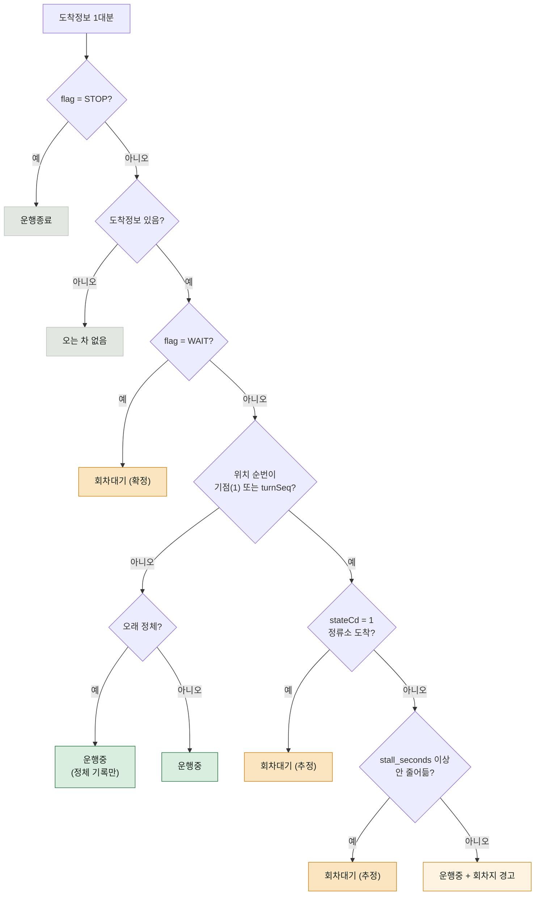

# 회차대기 판정 알고리즘

이 프로젝트가 존재하는 이유. 구현은 [judge.py](../src/trueeta/judge.py)(판정, 순수 함수)와
[state.py](../src/trueeta/state.py)(이력 추적)에 나뉘어 있다.

설계 배경은 [architecture.md](architecture.md), API 필드는 [api-endpoints.md](api-endpoints.md).

---

## 1. 무엇을 고치려는 건가

회차지에서 출발을 기다리는 버스가 화면에 **"4분"** 으로 뜬다.
그 숫자를 보고 나가면 실제로는 15분을 기다린다.

지도 앱도 같은 숫자를 보여준다. API 가 주는 `predictTime` 이
"지금 위치에서 여기까지 달리면 4분"이지, "회차지에서 얼마나 더 서 있을지"를
포함하지 않기 때문이다.

25번이 특히 심하다. 회차점이 정류장에서 **4정거장** 밖에 안 떨어져 있다.

---

## 2. 시간표와 대조하지 않는 이유

가장 먼저 떠오르는 방법 — "예정 시각과 비교한다" — 은 **쓸 수 없다.
비교할 시간표가 존재하지 않는다.**

| 소스 | 시간 관련 필드 | 시간표 |
|---|---|---|
| GBIS (5개 서비스·10개 오퍼레이션) | `upFirstTime`·`upLastTime`·`peekAlloc`·`nPeekAlloc` | **없음** |
| TAGO 버스노선정보 | `startvehicletime`·`endvehicletime`·`intervaltime` | **없음** |
| 고속·시외버스 API | 출발시각 목록 | 있음 |

고속·시외버스에는 있는데 시내·마을버스에는 없다. 이유가 분명하다 —
**마을버스는 정시 운행이 아니라 배차간격 운행**이라 "몇 시 몇 분 도착"이라는
데이터가 애초에 생성되지 않는다. 우리 22·25·59는 전부 마을버스다.
용인 마을버스 시간표 공개 데이터셋도 없다.

그래서 기준선은 시간표가 아니라 **ETA 가 줄어드는 속도**다.

---

## 3. 쓸 수 있는 신호 세 가지

| 신호 | 언제 알 수 있나 | 세기 | 한계 |
|---|---|---|---|
| `flag = WAIT` | 조회 1회 | **확정** | 마을버스에서는 거의 안 온다 (아직 실물 미관측) |
| **위치** | **조회 1회** | 추정 | 지나가는 중일 수도 있다 |
| ETA 감소율 | 조회 2회 이상 | 추정 | 시간이 걸린다 |

**즉시성이 중요하다.** 나가기 직전에 화면을 한 번 보는 용도이므로,
여러 번 관측해야 아는 신호는 이미 늦다. 조회 1회로 줄 수 있는 신호는
`flag` 와 **위치**뿐이고, `flag=WAIT` 이 안 오는 이상 위치가 유일한 즉시 신호다.

그래서 **위치만으로 회차대기를 확정하지는 않되**, 화면에는 즉시 알린다
(`Verdict.at_standing`).

---

## 4. 판정 순서



**`flag` 검사보다 "도착정보 있음?" 이 먼저인 것이 중요하다.**
실응답에서 확인한 것: `flag` 는 노선 단위 운행상태이지 차량 상태가 아니다.
차가 하나도 없는 노선도 `flag=PASS` 로 온다. `flag` 부터 보면 오판한다.
(자세히는 [phase1-probe.md 5장](phase1-probe.md#5-실응답에서-알아낸-것))

---

## 5. 위치 — 조회 1회로 아는 신호

```
차량 위치 순번 = staOrder − locationNo
대기 지점      = 1(기점) 또는 turnSeq(회차점)
```

`staOrder` 는 우리 정류장이 노선의 몇 번째인지, `locationNo` 는 차가 몇 정거장
전에 있는지다. 둘 다 도착정보 응답에 매번 들어온다 —
**위치정보 API 를 따로 부르지 않아도 된다.**

정류장마다 회차점이 몇 정거장 전인지가 다르다.

| 노선 | `staOrder` | `turnSeq` | 구간 | 회차점 대기 시 | 기점 대기 시 |
|---|---|---|---|---|---|
| 22 | 31 | 20 | 회차 후 | `locationNo = 11` | `locationNo = 30` |
| **25** | **27** | **23** | 회차 후 | **`locationNo = 4`** | `locationNo = 26` |
| 59 | 22 | 28 | 회차 전 | 해당 없음 (회차점이 뒤) | `locationNo = 21` |

59번은 우리 정류장이 회차점 **앞**이라 회차점 대기가 나타나지 않는다.
이 방향에서 대기 지점은 기점 하나뿐이다.

공식이 세 경우 모두에 그대로 들어맞으므로 **노선별 하드코딩은 없다.**

`staOrder` 나 `turnSeq` 가 없으면(`-1`) 위치 판정을 하지 않는다.
틀린 회차대기 표시가 아무 표시 없는 것보다 나쁘기 때문이다.

---

## 6. ETA 감소율 — 시간표를 대신하는 기준선

```
비율 = (이전 ETA − 현재 ETA) / 경과 시간

정상 주행   0.6 ~ 1.0     시간이 흐른 만큼 ETA 도 줄어든다
회차대기    0 근처         시계는 가는데 ETA 는 제자리
```

비율이 1.0 이 아니라 0.6~1.0 인 이유는 정차·신호 때문이다.
실측으로도 확인했다 — 10분 주기일 때 6분 경과 시점에 화면이 카카오맵보다
2분 빨랐다. 비율 약 0.67 이다.

### 횟수가 아니라 누적 초로 센다

폴링 주기가 피크 120초 / 그 외 600초로 달라진다.
"3회 연속" 이 6분일 수도 30분일 수도 있어 기준이 되지 못한다.
[StallTracker](../src/trueeta/state.py) 는 관측 시각을 기록하고
**안 줄어든 시간을 초로 누적**한다.

### 이전 구현의 버그

```python
# 잘못된 기준 — 지금은 고쳐졌다
not_closer = vehicle.eta_sec >= previous.eta_sec
stalls = previous.stalls + 1 if (same_place and not_closer) else 0
```

ETA 가 **1초만 줄어도** 카운터가 0 으로 리셋됐다.
회차지에 서 있어도 GBIS 가 주행시간을 재계산하며 ETA 를 조금씩 깎기 때문에,
이 기준으로는 정체가 **영원히 잡히지 않았다.**

지금은 비율로 본다. 정류장을 하나라도 지났으면(`locationNo` 감소)
ETA 와 무관하게 리셋한다 — 확실히 움직인 것이므로.

---

## 7. 임계값과 튜닝

| 값 | 현재 | 뜻 |
|---|---|---|
| `judge.stall_ratio` | `0.3` | 이 비율 미만이면 '안 줄어드는 중' |
| `judge.stall_seconds` | `240` | 그 상태가 이만큼 이어지면 회차대기로 확정 |

**둘 다 근거 없는 추정치다.** 관측 데이터로 정해야 한다.

폴러가 매 사이클 [observations.db](../src/trueeta/storage.py) 에 기록을 남긴다.
**API 호출은 1콜도 늘지 않는다** — 이미 받은 응답을 저장만 한다.

```bash
.venv/bin/python scripts/analyze.py --days 7
.venv/bin/python scripts/analyze.py --route 25    # 회차대기가 잦은 노선만
```

[analyze.py](../scripts/analyze.py) 가 하는 일:

1. 같은 차량의 연속 관측 쌍에서 감소율을 구한다
2. **대기 지점에 있을 때**와 **아닐 때**의 분포를 따로 낸다
3. 두 분포 사이의 경계를 `stall_ratio` 후보로 제안한다
4. 분포가 겹치면 "감소율만으로는 못 가른다"고 알려준다

정상 주행의 하한을 그대로 임계값으로 쓰면 정상 차량 절반이 걸린다.
**두 분포 사이**를 골라야 한다.

수집이 필요한 것은 **낮 시간대 25번**이다. 회차점이 4정거장 전이라
회차대기가 가장 자주 잡힐 노선이다.

---

## 8. 화면에 어떻게 나오는가

| 판정 | 표시 | 의도 |
|---|---|---|
| `flag=WAIT` | **채운** 주황 배지 `회차대기` | API 확정 |
| 위치 + `stateCd=1` 또는 장기 정체 | **테두리만** 있는 배지 `회차대기` | 추정임을 구분 |
| 위치만 (미확정) | ETA 를 **회색**으로 + `회차지 · 더 걸릴 수 있음` | 숫자는 남긴다 |
| 운행중 | 민트색 ETA | |
| 도착정보 없음 | `—` | |
| `flag=STOP` | `운행종료` | |

**미확정일 때 숫자를 지우지 않는 것이 의도된 선택이다.**
"빨라야 5분, 하지만 더 걸릴 수 있음" 이 "언제 올지 모름" 보다 정보가 많다.
숫자를 죽이고 경고를 붙이는 쪽이 판단에 쓸모 있다.

---

## 9. 알려진 한계

- **`flag=WAIT` 실물을 아직 못 봤다.** 확정 경로는 코드로만 존재하고
  실제로 검증되지 않았다
- **임계값에 근거가 없다.** 7장 참고
- **회차점을 지나가는 중인 차와 서 있는 차를 즉시 구분하지 못한다.**
  `stateCd=1`(정류소 도착)이면 확정하지만, 그 값을 못 믿는 경우
  `stall_seconds` 만큼 기다려야 한다. 그 사이에는 "회차지 경고"만 표시된다
- **기점 대기와 회차점 대기를 구분하지 않는다.** 둘 다 대기 지점으로 본다
- **2호차의 `at_standing` 은 화면에 반영하지 않는다.** 판정은 하지만
  두 번째 칸이 좁아 경고를 붙이지 않았다
