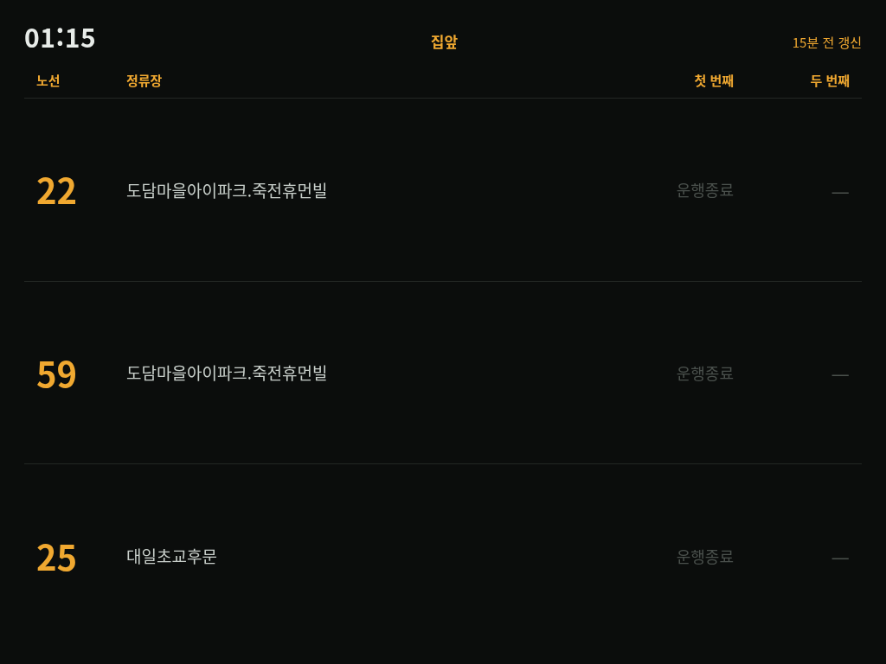
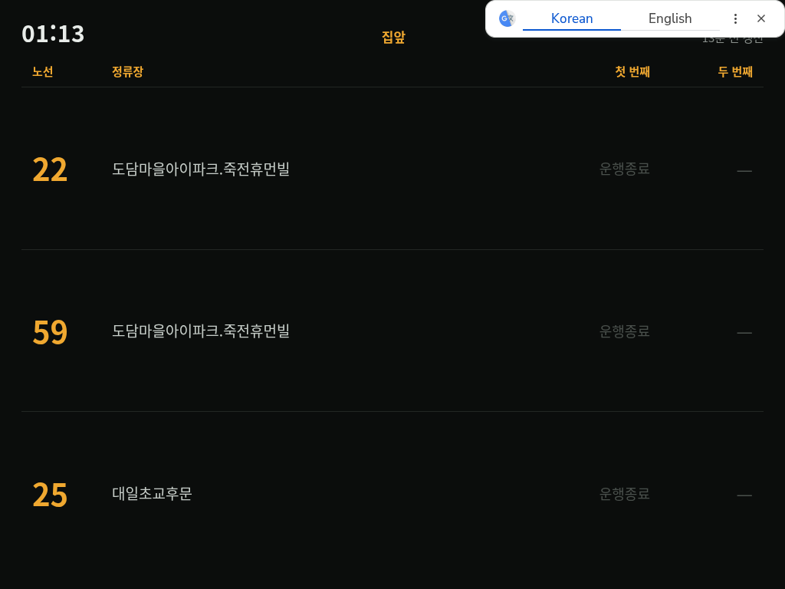

# 키오스크 자동실행

전원만 꽂으면 8인치 화면에 전광판이 뜨게 한다. (2026-09-29)



*실제 HDMI 출력을 `grim` 으로 캡처한 것. 새벽이라 전부 운행종료다.*

---

## 구성

```
부팅
 └ lightdm 자동 로그인 (hun, rpd-labwc)
    └ labwc -m
       ├ /etc/xdg/labwc/autostart      패널·바탕화면 (시스템, 그대로)
       └ ~/.config/labwc/autostart      + scripts/kiosk.sh   ← 추가한 한 줄
            1. /api/health 응답까지 대기 (최대 180초)
            2. 프로필 설정 주입 (번역 끄기, 정상 종료 표시)
            3. chromium --kiosk http://localhost:8099/
            4. 꺼지면 5초 뒤 다시 2번부터
```

| 파일 | 역할 |
|---|---|
| [scripts/kiosk.sh](../scripts/kiosk.sh) | 키오스크 로직 전부 |
| [scripts/labwc-autostart](../scripts/labwc-autostart) | `~/.config/labwc/autostart` 의 저장소 사본 |
| `~/.cache/trueeta-kiosk/` | 키오스크 전용 Chromium 프로필. 평소 쓰는 브라우저와 섞이지 않는다 |
| `var/logs/kiosk.log` | Chromium 기동·종료 기록만 |

로직은 저장소에 두고 autostart 에는 한 줄만 둔다. 버전 관리가 되고, 끄기도 쉽다.

### 조작

```bash
touch ~/.config/trueeta/kiosk.disabled     # 끄기 (루프가 멈추고, 다음 부팅부터 안 뜬다)
rm ~/.config/trueeta/kiosk.disabled        # 다시 켜기 (다음 로그인부터)
pkill -f "chromium.*trueeta-kiosk"         # 새로고침 대신 재시작 — 5초 뒤 다시 뜬다
tail var/logs/kiosk.log                    # 언제 떴고 언제 죽었나
```

다른 프리셋을 띄우려면 `~/.config/labwc/autostart` 의 줄을 이렇게:

```bash
TRUEETA_KIOSK_URL="http://localhost:8099/?preset=출근-신분당" /home/hun/TrueETA/scripts/kiosk.sh &
```

---

## 확인한 전제

| | 확인 방법 | 결과 |
|---|---|---|
| 자동 로그인 | `/etc/lightdm/lightdm.conf` | `autologin-user=hun`, `autologin-session=rpd-labwc` |
| 컴포지터 | `ps` | `labwc -m` (hun) |
| autostart 가 시스템 것을 대체하나 | `man labwc-config` | **`-m`(--merge-config)이면 더해진다.** "user-specific files will augment system-wide configurations" |
| 화면 꺼짐 | `ps` 에 `swayidle` 없음 | 꺼지지 않는다 |
| 출력 | `wlr-randr` | **`HDMI-A-2`**, 1024×768 (preferred, current) |

> 출력 이름이 `HDMI-A-2` 다. architecture.md 의 `video=HDMI-A-1:...` 메모와 다르다.
> 해상도가 이미 1024×768 로 잡혀 있어 그 설정은 필요 없었다. 야간 화면 끄기
> (`wlr-randr --output HDMI-A-2 --off`)를 할 때 이 이름을 써야 한다.

---

## 겪은 문제 — 원인·행동·결과

SSH 에서 `WAYLAND_DISPLAY=wayland-0` 으로 실제 데스크톱 세션에 띄우고,
`grim` 으로 HDMI 출력을 캡처해 가며 확인했다.

### 1. Chromium 이 뜨자마자 죽었다

**원인.** Chromium 은 기본으로 X11 을 찾는다. `WAYLAND_DISPLAY` 만 있고 `DISPLAY` 가
없으면 `Missing X server or $DISPLAY` 로 코드 1 종료. 재시작 루프가 5초마다 뜨고
죽기를 반복했다. (출력을 버리게 해둬서 이유가 안 보였고, 루프를 멈추고 직접 띄워서
찾았다.)

**행동.** `--ozone-platform=wayland` 로 네이티브 Wayland 를 명시했다. autostart 에서는
labwc 가 Xwayland 의 `DISPLAY` 도 주므로 X11 로도 떴겠지만, 환경에 기대지 않는다.
labwc 가 Wayland 컴포지터라 네이티브가 더 가볍기도 하다.

**결과.** 떴다. 패널이 사라지고 1024×768 을 꽉 채운다.

### 2. 번역 팝업이 갱신 시각을 가렸다



**원인.** Chromium UI 가 영어(`en-GB`)라 한국어 페이지에 구글 번역을 제안한다.
오른쪽 위를 덮어서 "N분 전 갱신" 이 안 보였다.

**행동과 결과.** 세 번 시도했다.

| 시도 | 결과 |
|---|---|
| `--disable-features=Translate,TranslateUI` + `--lang=ko` | **안 됨.** 리눅스에서 `--lang` 은 무시되고, 이 버전(147)은 플래그로 안 꺼진다 |
| 페이지에 `<meta name="google" content="notranslate">`, `<html translate="no">` | **안 됨.** 서버가 새 HTML 을 내보내는 것까지 확인했는데도 떴다 |
| **프로필 `Preferences` 에 `translate.enabled=false`, `translate_blocked_languages=["ko"]`** | **됐다** |

그래서 `kiosk.sh` 가 **Chromium 을 띄우기 직전마다** 프로필에 이 값을 써 넣는다.
Chromium 은 종료할 때 이 파일을 덮어쓰므로 켜진 상태에서 고치면 안 먹는다.
기존 설정은 보존하고 필요한 키만 바꾼다.

페이지의 `notranslate` 선언은 효과는 없었지만 남겨뒀다 — 폰의 Chrome 등 다른
브라우저에서는 먹을 수 있다.

### 3. (예방) 전원을 뽑으면 "페이지 복원" 창

**원인.** 전원을 그냥 뽑으면 Chromium 이 비정상 종료로 기록해 다음 부팅에
"페이지를 복원하시겠습니까" 창이 뜬다. 항상 켜두는 기기라 늘 그렇게 꺼진다.

**행동.** 같은 프로필 주입에서 `profile.exit_type=Normal`, `exited_cleanly=true` 로
되돌려 둔다. `--hide-crash-restore-bubble` 플래그도 같이 줬다.

**결과.** 이건 실제 전원 차단으로는 아직 확인하지 못했다 (아래 "확인 못 한 것").

### 재시작 루프

Chromium 을 강제로 꺼봤다 (`pkill`). 5초 뒤 다시 떴다.

```
01:13:48 chromium 종료 (코드 0) — 5초 뒤 다시 띄운다
01:13:53 chromium 시작: http://localhost:8099/
```

---

## 확인 못 한 것

- **재부팅 후 autostart 로 실제로 뜨는지.** 지금 떠 있는 키오스크는 SSH 에서 띄운
  것이다. autostart 는 로그인할 때 실행되므로 재부팅해야 확인된다
- **전원을 그냥 뽑았을 때** 복원 창이 정말 안 뜨는지
- **마우스 커서.** 화면 가운데에 커서가 남을 수 있다. 마우스를 안 꽂으면 문제없다

## 알려진 것

- **새벽엔 오른쪽 위가 주황색 "N분 전 갱신" 이 된다.** 운행시간 밖에는 조회를 안 해서
  갱신 시각이 멈추고, 15분이 넘으면 주황색으로 바뀐다. 고장은 아니다
- 화면은 꺼지지 않는다. 야간에 끄는 건 따로 할 일이다 ([todo.md](todo.md))
