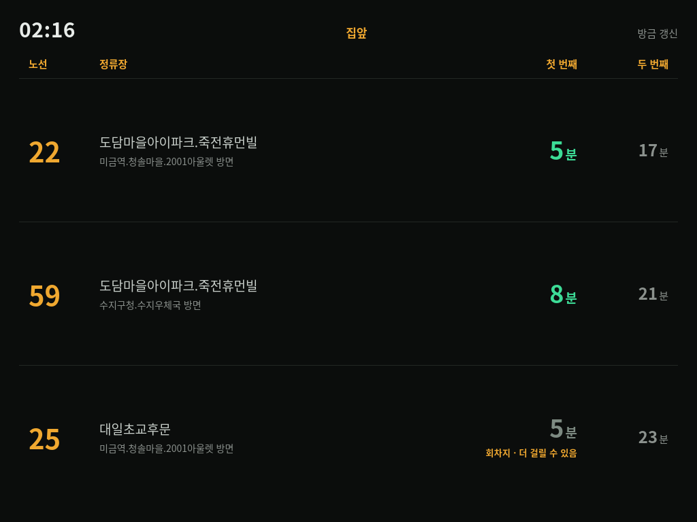
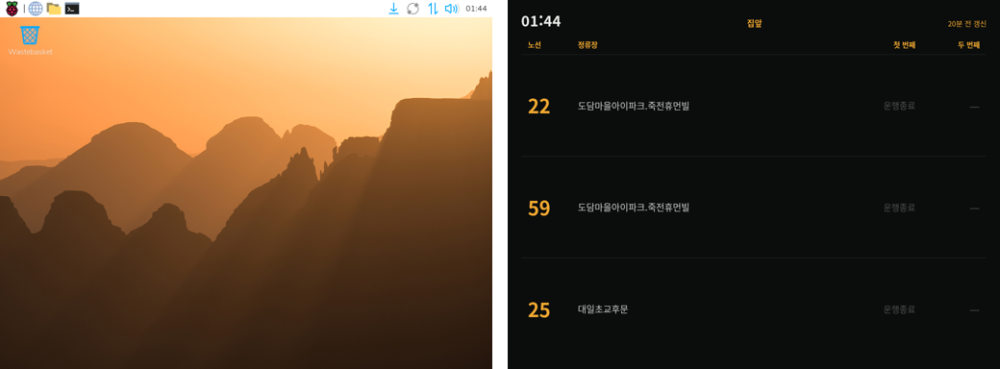

# 키오스크 화면

8인치 화면(1024×768)에 상시 떠 있는 전광판의 사용 안내와 구현 기록.
전원만 꽂으면 뜬다. (2026-09-29)


*실제 HDMI 출력을 `grim` 으로 캡처한 것. 새벽이라 전부 운행종료다.*

| 알고 싶은 것 | 절 |
|---|---|
| 화면에 나온 게 무슨 뜻인가 | [1. 화면 읽는 법](#1-화면-읽는-법) |
| 다른 프리셋·폰에서 보기 | [2. 다른 화면 띄우기](#2-다른-화면-띄우기) |
| 키오스크에서 나가기 | [3. 조작](#3-조작) |
| 화면이 이상하다 | [4. 문제 해결](#4-문제-해결) |
| 어떻게 뜨게 만들었나 | [5~7](#5-어떻게-뜨나) |

---

## 1. 화면 읽는 법



*운행 중 화면 예시 (데모 데이터). 22·59번은 정상, 25번은 회차지 경고.*

### 영역

```
┌────────────────────────────────────────────────────────────┐
│ 02:16            집앞                           방금 갱신 │  ← ① 시계 · ② 프리셋 · ③ 갱신 상태
│ 노선   정류장                        첫 번째      두 번째 │
├────────────────────────────────────────────────────────────┤
│  22    도담마을아이파크.죽전휴먼빌        5분         17분 │  ← ④ 노선 · ⑤ 정류장
│        미금역.청솔마을.2001아울렛 방면                     │     ⑥ 방면
├────────────────────────────────────────────────────────────┤
│  25    대일초교후문                       5분         23분 │  ← ⑦ 첫 번째 차 · ⑧ 두 번째 차
│        미금역.청솔마을.2001아울렛 방면  회차지 · 더 걸릴 수 있음 │
└────────────────────────────────────────────────────────────┘
```

| | 영역 | 내용 |
|---|---|---|
| ① | 시계 | 라즈베리파이 시각. 부팅 직후 잠깐 틀릴 수 있다 (RTC 없음) |
| ② | 프리셋 이름 | 지금 띄운 묶음. 기본은 `집앞` |
| ③ | 갱신 상태 | 아래 표 |
| ④ | 노선 | 주황 큰 글씨 |
| ⑤ | 정류장 | 프리셋에 저장된 이름 |
| ⑥ | 방면 | 진행방향 종점. **양방향 정류장이 이름이 같아서** 이걸로 방향을 확인한다. 운행시간 밖에는 안 나온다 |
| ⑦ | 첫 번째 차 | 가장 먼저 올 차. 아래 표 |
| ⑧ | 두 번째 차 | 그다음 차. 작고 회색. 회차지 경고는 붙지 않는다 |

### 도착 칸 (⑦ ⑧)

| 표시 | 뜻 |
|---|---|
| `5분` 민트색 | 운행 중. 남은 시간 (올림) |
| `곧 도착` | 1분 이내. **0을 지나도 다음 조회 전까지 그대로 남는다** (아래 "시간이 흐르는 방식") |
| `5분` **회색** + `회차지 · 더 걸릴 수 있음` | 차가 기점·회차점 위치에 있다. 거기서 서 있을 수 있어 숫자를 믿기 어렵다 |
| `회차대기` 채운 주황 배지 | API 가 회차지 대기(`flag=WAIT`)라고 확정 |
| `회차대기` 테두리만 | 위치·정체로 추정한 회차대기 |
| `회차지 대기` **테두리 배지** + `최소 3분` | 운행 중인데 목록에 차가 없다 = 다음 차가 아직 회차지를 안 떠났다 (B안) |
| 〃 + `최소 3분 · 보통 12분 안` / `· 배차 넘김` | 위와 같고, 배차간격 추정까지 붙은 것. **검증을 통과한 노선만** 나온다 (지금은 없음) |
| `운행종료` | 운행시간 밖, 노선별 막차가 지남, 또는 API 가 운행 종료(`flag=STOP`) |
| `—` | 차도 없고 판정할 근거도 없다 — 그 정류장 조회 실패, 또는 응답에 노선 자체가 없음 |

> **22·25번은 하루 대부분 `회차지 대기` 다.** GBIS 는 회차지를 **출발한** 차만
> 도착정보에 넣어서, 회차지에 서 있는 차는 목록에 아예 없다 (관측 374행에서 확인).
> 9/28 에 22번은 사이클의 61%, 25번은 약 70% 가 차 없음이었다.
>
> - **최소 N분** 은 확실하다. 회차지를 막 떠나도 여기까지 이만큼 걸린다
>   (9/29 학습값: 22번 약 8분, 25번 약 2분 30초). 차가 안 보이는 동안은 줄지 않는다
> - **보통 M분 안** 은 배차간격으로 추정한다: 마지막 차가 사라진 뒤 배차간격이
>   흐르면 다음 차가 온다. **지금은 모든 노선에서 꺼 두었다.** 9/29 저녁 검증에서
>   22번은 늘 3분 일찍 와서(절대오차 4.1분), 25번은 들쭉날쭉해서(6.9분) 기준(3분)을
>   못 넘었다. 노선별로 `config.yaml` 의 `judge.show_expected` 에 넣으면 켜진다
> - 켜진 노선에서 M 은 1초씩 줄되 N 밑으로는 안 내려가고, N 과 같아지면 빠진다
>
> 테두리만 있는 배지는 "추정" 이라는 뜻이다. 위 표의 채운 `회차대기` 배지와
> `회차지` 경고는 A안 판정이라 이 정류장들에선 거의 나오지 않는다.
> 자세히는 [judge-absence-design.md](judge-absence-design.md).

### 갱신 상태 (③)

| 표시 | 뜻 |
|---|---|
| `방금 갱신` 회색 | 1분 안에 조회했다 |
| `N분 전 갱신` 회색 | 정상. 낮엔 2분, 그 외엔 10분마다 조회한다 (`config.yaml` 의 `boost` 가 켜져 있으면 그 주기) |
| `N분 전 갱신` **주황** | 15분 넘게 조회가 없었다. **새벽엔 정상** (운행시간 밖엔 조회를 안 한다). 낮에 이러면 [문제 해결](#4-문제-해결) |
| **빨간 글씨** (예: `도담마을…: ReadTimeout`) | 그 정류장 조회 실패. **그 정류장 줄은 `—` 로 바뀐다** (직전 값을 유지하지 않는다). 다른 정류장은 정상 |
| 빨간 `N번이 이 정류장 응답에 없음 — 설정 확인` | 프리셋의 정류장·노선 조합이 틀렸다. 3사이클 연속이면 뜬다 |
| 빨간 `서버 연결 실패` | 화면이 서버(8099)에 못 닿는다. 마지막 값을 유지하며 15초마다 다시 시도한다 |

### 시간이 흐르는 방식

```
API 조회        서버가 GBIS 에 묻는다        낮 2분 / 그 외 10분마다
화면 → 서버     화면이 서버에 묻는다          15초마다   (API 호출 아님, 공짜)
카운트다운      화면이 혼자 깎는다            1초마다
```

남은 시간은 **서버가 API 를 조회한 시각 기준**으로 1초씩 깎는다. 그래서 조회 사이
10분 동안에도 숫자가 멈추지 않는다.

두 가지 알고 있어야 할 것:

- **낙관적으로 어긋난다.** 실제 버스는 정차·신호 때문에 시계보다 느리게 온다
  (실측 감소율 0.6~0.8). 조회 간격이 길수록 화면이 실제보다 빨리 줄어든다.
  10분 주기일 때 6분 경과 시점에 카카오맵보다 2분 빨랐다. 버스 타는 낮 시간대를
  2분 주기로 둔 이유다
- **`곧 도착` 이 오래 남을 수 있다.** 카운트다운이 0을 지나도 다음 조회 전까지는
  `곧 도착` 으로 둔다. 비피크(10분 주기)엔 최대 10분까지. 그 사이 버스는 이미
  지나갔을 수 있다

### 밤

운행시간(05:50~00:10) 밖에는 API 를 부르지 않는다. 화면은 모든 노선을 `운행종료` 로
두고, 갱신 시각이 멈춰 15분 뒤 주황색이 된다. 방면(⑥)도 사라진다. 고장이 아니다.

---

## 2. 다른 화면 띄우기

| 주소 | 내용 |
|---|---|
| `http://localhost:8099/` | 기본 프리셋 (`집앞`) — 키오스크가 띄우는 것 |
| `http://localhost:8099/?preset=출근-신분당` | 다른 프리셋 |
| `http://localhost:8099/?demo=1` | 가짜 데이터. 화면을 손볼 때. API 를 안 탄다 |
| `http://localhost:8099/edit` | 프리셋 편집 (정류장 검색) |

**폰·노트북에서:** 같은 공유기면 `http://<라즈베리파이 IP>:8099/`, 밖에서는 Cloudflare
Tunnel 주소 ([remote-access.md](remote-access.md)). 폰에서 다른 프리셋을 열어두는
동안만 그 프리셋의 정류장이 추가로 조회된다 ([preset-design.md](preset-design.md)).

**키오스크가 기본 말고 다른 프리셋을 띄우게** 하려면 `~/.config/labwc/autostart` 의 줄을:

```bash
TRUEETA_KIOSK_URL="http://localhost:8099/?preset=출근-신분당" /home/hun/TrueETA/scripts/kiosk.sh &
```

또는 `/edit` 에서 그 프리셋을 **기본으로** 지정하면 키오스크 설정을 안 고쳐도 된다.

---

## 3. 조작

### 나가기 / 돌아가기

**`Ctrl+Alt+K`** — 키오스크를 잠깐 끄고 바탕화면으로. **한 번 더 누르면 돌아온다.**



*왼쪽: 나간 뒤 바탕화면. 오른쪽: 다시 누른 뒤 전광판.*

| | 방법 | 재부팅하면 |
|---|---|---|
| **잠깐 나가기** | `Ctrl+Alt+K` | **다시 키오스크로** — 전원만 꽂으면 전광판 |
| 영구 끄기 | `touch ~/.config/trueeta/kiosk.disabled` | 계속 꺼져 있다 |

- `Alt+F4` 로 닫으면 **5초 뒤 다시 뜬다** (재시작 루프). 나가려면 `Ctrl+Alt+K`
- 나간 상태에서 터미널은 `Ctrl+Alt+T` (시스템 기본 단축키)
- 키보드가 없으면 SSH 에서 같은 스크립트를 부른다

```bash
scripts/kiosk-toggle.sh                    # 잠깐 나가기 / 돌아가기 (= Ctrl+Alt+K)
touch ~/.config/trueeta/kiosk.disabled     # 영구 끄기 (다음 부팅부터 안 뜬다)
rm ~/.config/trueeta/kiosk.disabled        # 다시 켜기 (다음 로그인부터)
tail var/logs/kiosk.log                    # 언제 떴고 언제 죽었나
```

### 화면만 새로 고치기

키오스크엔 주소창·새로고침 버튼이 없다. 두 번 누르면 된다:
`Ctrl+Alt+K` → `Ctrl+Alt+K` (나갔다 돌아오기). 서버 코드를 바꾼 뒤 화면을 새로
받아야 할 때 쓴다.

---

## 4. 문제 해결

| 증상 | 원인 | 할 일 |
|---|---|---|
| **바탕화면만 보인다** | 잠깐 나가기 상태 / 영구 끄기 / Chromium 이 계속 죽음 | `Ctrl+Alt+K` 먼저. 안 되면 `ls ~/.config/trueeta/kiosk.disabled`, `tail var/logs/kiosk.log` |
| 부팅 직후 한동안 바탕화면 | 키오스크가 서버(`/api/health`)를 최대 180초 기다린다 | 기다린다. 서버가 안 뜨면 `systemctl status trueeta` |
| 빨간 `서버 연결 실패` | 서버가 죽었거나 재시작 중 | `systemctl status trueeta`, `tail var/logs/trueeta.log` |
| 빨간 `…: ReadTimeout` 등, 그 정류장 줄이 `—` | GBIS 응답 지연. 한두 번은 흔하다. 다음 조회에서 돌아온다 | 계속되면 `tail var/logs/trueeta.log` |
| 빨간 `N번이 이 정류장 응답에 없음` | 프리셋 정류장이 틀렸다 (양방향 중 반대편일 가능성이 크다) | `/edit` 에서 정류장을 다시 고른다. 방면을 확인할 것 |
| **낮인데** 주황 `N분 전 갱신` | 폴러가 멈췄다 | `grep 사이클 var/logs/trueeta.log \| tail`. 사이클 줄이 끊겼으면 서비스 재시작 |
| `회차지 대기 · 배차 넘김` 이 오래 간다 | 배차가 불규칙하거나 결행. 막차 직후일 수도 | 오래 이어지면 `/api/board` 로 원자료 확인 |
| 한 줄이 계속 `—` | 응답에 그 노선이 없다 (정류장·노선 조합 오류). 3사이클 뒤 빨간 경고가 같이 뜬다 | 프리셋 편집 화면에서 정류장·노선 확인 |
| 오른쪽 위에 **번역 팝업** | 키오스크 프로필 설정이 풀렸다 | `Ctrl+Alt+K` 두 번. 띄울 때마다 다시 주입된다 |
| **페이지 복원** 창 | 전원을 뽑아서 비정상 종료로 기록됨 | 원래 막혀 있어야 한다. 뜨면 `Ctrl+Alt+K` 두 번 |
| 글자가 네모(□) | 한글 폰트 없음 | `sudo apt install fonts-noto-cjk` |
| 화면 가운데 **마우스 커서** | 마우스가 꽂혀 있다 | 마우스를 빼거나 구석으로 |
| `Ctrl+Alt+K` 가 안 먹는다 | 단축키 설정이 안 읽혔다 | `labwc --reconfigure`. 그래도 안 되면 SSH 에서 `scripts/kiosk-toggle.sh` |
| `Ctrl+Alt+T` 등 기존 단축키가 안 먹는다 | 사용자 `rc.xml` 이 시스템 것을 덮었다 | `rm ~/.config/labwc/rc.xml && labwc --reconfigure` |
| 밤에도 화면이 켜져 있다 | 아직 야간 끄기가 없다 | [todo.md](todo.md) |

원자료를 직접 보려면 (폰·노트북 브라우저에서):
`http://<라즈베리파이 IP>:8099/api/board`, `/api/health`

---

## 5. 어떻게 뜨나

```
부팅
 └ lightdm 자동 로그인 (hun, rpd-labwc)
    └ labwc -m
       ├ /etc/xdg/labwc/autostart      패널·바탕화면 (시스템, 그대로)
       └ ~/.config/labwc/autostart      + scripts/kiosk.sh   ← 추가한 한 줄
            0. 이미 떠 있으면 양보 (flock)
            1. /api/health 응답까지 대기 (최대 180초)
            2. 프로필 설정 주입 (번역 끄기, 정상 종료 표시)
            3. chromium --kiosk http://localhost:8099/
            4. 꺼지면 5초 뒤 2번부터 — 단, 나가기·영구끄기 표시가 있으면 멈춘다
```

| 파일 | 역할 |
|---|---|
| [scripts/kiosk.sh](../scripts/kiosk.sh) | 키오스크 로직 전부 |
| [scripts/kiosk-toggle.sh](../scripts/kiosk-toggle.sh) | 잠깐 나가기 / 돌아가기 |
| [scripts/labwc-autostart](../scripts/labwc-autostart) | `~/.config/labwc/autostart` 의 저장소 사본 |
| [scripts/labwc-rc.xml](../scripts/labwc-rc.xml) | `~/.config/labwc/rc.xml` 사본 — `Ctrl+Alt+K` |
| [src/trueeta/web/index.html](../src/trueeta/web/index.html) | 화면 자체 (빌드 없는 HTML 한 장) |
| `~/.cache/trueeta-kiosk/` | 키오스크 전용 Chromium 프로필. 평소 브라우저와 섞이지 않는다 |
| `/run/user/1000/trueeta-kiosk.paused` | 잠깐 나가기 표시. 메모리라 재부팅하면 사라진다 |
| `var/logs/kiosk.log` | Chromium 기동·종료 기록만 (Chromium 출력은 버린다 — 끝없이 쏟아내서) |

로직은 저장소에 두고 autostart 에는 한 줄만 둔다. 버전 관리가 되고 끄기도 쉽다.

### Chromium 옵션

| 옵션 | 이유 |
|---|---|
| `--ozone-platform=wayland` | 기본(X11)이면 "Missing X server" 로 바로 죽었다 |
| `--kiosk` | 전체화면, 주소창·탭 없음 |
| `--user-data-dir=~/.cache/trueeta-kiosk` | 전용 프로필 |
| `--password-store=basic` | 키링 잠금 해제 창이 화면을 가리지 않게 |
| `--hide-crash-restore-bubble` 등 | 페이지 복원 창 방지 (프로필 주입과 이중) |
| `--disable-features=Translate,TranslateUI`, `--lang=ko` | 번역 팝업 방지 시도 — **효과 없었다.** 프로필 주입이 실제로 막는다 |

---

## 6. 확인한 전제

| | 확인 방법 | 결과 |
|---|---|---|
| 자동 로그인 | `/etc/lightdm/lightdm.conf` | `autologin-user=hun`, `autologin-session=rpd-labwc` |
| 컴포지터 | `ps` | `labwc -m` (hun) |
| autostart 가 시스템 것을 대체하나 | `man labwc-config` | **`-m`(--merge-config)이면 더해진다.** "user-specific files will augment system-wide configurations" |
| 단축키 충돌 | `/etc/xdg/labwc/rc.xml` | `C-A-k` 는 비어 있다. `C-A-t` 는 터미널 |
| 화면 꺼짐 | `ps` 에 `swayidle` 없음 | 꺼지지 않는다 |
| 출력 | `wlr-randr` | **`HDMI-A-2`**, 1024×768 (preferred, current) |

> 출력 이름이 `HDMI-A-2` 다 (처음 메모엔 `HDMI-A-1`). 해상도가 이미 1024×768 로
> 잡혀 있어 부팅 설정은 필요 없었다. 야간 화면 끄기는
> `wlr-randr --output HDMI-A-2 --off` 로 해야 한다.

---

## 7. 만들며 겪은 문제 — 원인·행동·결과

SSH 에서 `WAYLAND_DISPLAY=wayland-0` 으로 실제 데스크톱 세션에 띄우고,
`grim` 으로 HDMI 출력을 캡처해 가며 확인했다.

### 7-1. Chromium 이 뜨자마자 죽었다

**원인.** Chromium 은 기본으로 X11 을 찾는다. `WAYLAND_DISPLAY` 만 있고 `DISPLAY` 가
없으면 `Missing X server or $DISPLAY` 로 코드 1 종료. 재시작 루프가 5초마다 뜨고
죽기를 반복했다. 출력을 버리게 해둬서 이유가 안 보였고, 루프를 멈추고 직접 띄워서 찾았다.

**행동.** `--ozone-platform=wayland` 로 네이티브 Wayland 를 명시했다. autostart 에서는
labwc 가 Xwayland 의 `DISPLAY` 도 주므로 X11 로도 떴겠지만, 환경에 기대지 않는다.

**결과.** 떴다. 패널이 사라지고 1024×768 을 꽉 채운다.

### 7-2. 번역 팝업이 갱신 시각을 가렸다


**원인.** Chromium UI 가 영어(`en-GB`)라 한국어 페이지에 구글 번역을 제안한다.
오른쪽 위를 덮어서 갱신 상태(③)가 안 보였다.

**행동과 결과.** 세 번 시도했다.

| 시도 | 결과 |
|---|---|
| `--disable-features=Translate,TranslateUI` + `--lang=ko` | **안 됨.** 리눅스에서 `--lang` 은 무시되고, 이 버전(147)은 플래그로 안 꺼진다 |
| 페이지에 `<meta name="google" content="notranslate">`, `<html translate="no">` | **안 됨.** 서버가 새 HTML 을 내보내는 것까지 확인했는데도 떴다 |
| **프로필 `Preferences` 에 `translate.enabled=false`, `translate_blocked_languages=["ko"]`** | **됐다** |

그래서 `kiosk.sh` 가 **Chromium 을 띄우기 직전마다** 프로필에 이 값을 써 넣는다.
Chromium 은 종료할 때 이 파일을 덮어쓰므로 켜진 상태에서 고치면 안 먹는다.
기존 설정은 보존하고 필요한 키만 바꾼다. 페이지의 `notranslate` 선언은 효과는
없었지만 남겨뒀다 — 폰 브라우저에서는 먹을 수 있다.

### 7-3. (예방) 전원을 뽑으면 "페이지 복원" 창

**원인.** 전원을 그냥 뽑으면 Chromium 이 비정상 종료로 기록해 다음 부팅에
"페이지를 복원하시겠습니까" 창이 뜬다. 항상 켜두는 기기라 늘 그렇게 꺼진다.

**행동.** 같은 프로필 주입에서 `profile.exit_type=Normal`, `exited_cleanly=true` 로
되돌려 둔다. `--hide-crash-restore-bubble` 플래그도 같이 줬다.

**결과.** 실제 전원 차단으로는 아직 확인하지 못했다 (8장).

### 7-4. 재시작 루프

Chromium 을 강제로 꺼봤다. 5초 뒤 다시 떴다.

```
01:13:48 chromium 종료 (코드 0) — 5초 뒤 다시 띄운다
01:13:53 chromium 시작: http://localhost:8099/
```

### 7-5. (나가기 구현 중) 토글이 엉뚱한 셸을 죽였다

**원인.** 처음엔 `pkill -f "chromium.*trueeta-kiosk"` 로 Chromium 을 찾았다.
`-f` 는 명령줄 전체에서 찾으므로, **그 두 단어가 명령줄에 들어간 다른 프로세스**
(테스트하던 셸)까지 죽였다. 두 번 겪었다.

**행동.** 프로세스 **이름이 정확히 `chromium`** 이고(`pgrep -x`), 키오스크 프로필
(`--user-data-dir=...trueeta-kiosk`)을 쓰는 **메인 프로세스만**(`--type=` 없는 것)
끈다. 자식은 메인이 죽으면 따라 죽는다. 평소 쓰는 Chromium 도 건드리지 않는다.

**결과.** 이후 엉뚱한 프로세스가 죽지 않았다.

### 7-6. (나가기 구현 중) 나갔다 들어오면 상태가 뒤집혔다

**원인.** 나갔다가 5초 안에 다시 들어오면 이전 루프가 아직 살아 있어 루프 두 개가
같은 프로필로 Chromium 을 띄우려 든다. 그래서 `flock` 잠금으로 루프를 하나로 제한했다.
그런데 루프가 잠금을 연 채 Chromium 을 띄우면서 **Chromium 과 자식들이 잠금 파일
핸들을 물려받았다.** 루프를 꺼도 Chromium 이 살아 있는 한 잠금이 안 풀려, 새 루프가
"이미 실행 중" 이라며 물러났다. 그 뒤로 나가기·돌아가기가 반대로 동작했다.

```
01:41:56 chromium 시작
01:42:00 이미 실행 중인 키오스크가 있다 — 그쪽에 맡긴다   ← 새 루프가 양보해 버림
```

**행동.** Chromium 을 띄울 때 잠금 핸들을 닫고 넘긴다 (`9>&-`).

**결과.** 네 단계를 실제 화면으로 확인했다.

| 단계 | Chromium | 루프 |
|---|---|---|
| 시작 | 떠 있음 | 1 |
| 나가기 | 꺼짐 | 0 |
| 돌아가기 | 떠 있음 | 1 |
| 2초 만에 나갔다 들어오기 | 떠 있음 | **1** (중복 없음) |

---

## 8. 확인 못 한 것 / 남은 것

- ~~재부팅 후 autostart 로 실제로 뜨는지~~ — **확인됨** (재부팅만 하면 뜬다)
- **`Ctrl+Alt+K` 를 실제 키보드로 누르는 것.** 단축키가 부르는 스크립트는 화면으로
  검증했지만, 키 입력 자체는 SSH 에서 보낼 수 없어 못 해봤다
- **`Ctrl+Alt+T` 등 기존 단축키가 그대로인지.** 사용자 `rc.xml` 을 새로 만들었다.
  labwc 가 `-m` 이라 시스템 설정에 더해지는 게 맞지만 직접 눌러보진 못했다
- **전원을 그냥 뽑았을 때** 복원 창이 정말 안 뜨는지
- **마우스 커서** 숨기기는 안 했다
- **야간 화면 끄기** — `wlr-randr --output HDMI-A-2 --off`. 드라이버 보드가 백라이트까지
  끄는지는 실물로 확인해야 한다 (안 끄면 릴레이)
- **조회 한 번 실패하면 그 정류장 줄이 `—` 가 된다.** 일시적 타임아웃에도 화면이
  비는 셈이다. 직전 값을 잠깐 유지하는 편이 나을 수 있다
- ~~화면에 B안~~ — **반영함** (2026-09-29). `보통 M분` 은 검증 불합격이라 꺼 두었다.
  배차 보정(×0.87)을 적용한 22번이 다른 날 데이터로도 3분 안이면 22번부터 켠다
